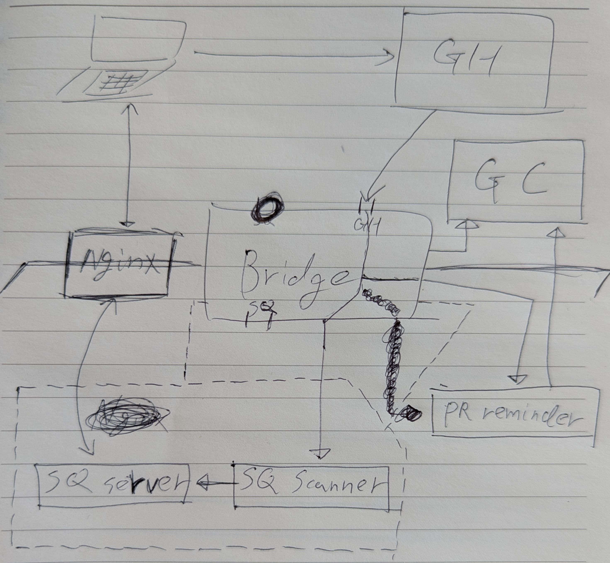

# Overall Structure


# On Each Parts
## Bridge
```
╔═════ Host Machine ══════════════════════════════════════════════════════════════════╗
║                                                                                     ║
║ ╔═══ Container ═════════════════════════════╗                                       ║
║ ║                                           ║                                       ║
║ ║  1. Auth via secret                       ║                                       ║
║ ║  2. payload = base64(json)                ║                                       ║
║ ║  3. `ssh $HOST_MACHINE handle_payload.sh  ║                                       ║
║ ║   \    [github|sonarqube] payload`        ║                                       ║
║ ║    \                                      ║                                       ║
║ ╚═════\═════════════════════════════════════╝                                       ║
║        \                                                                            ║
║ ╔═══ handle_payload.sh(atomic) ═════════════════════════════════════════════════╗   ║
║ ║                                                                               ║   ║
║ ║ ╔═════ GitHub ═════════════════════╗    ╔═════SonarQube════════════════════╗  ║   ║
║ ║ ║                                  ║    ║                                  ║  ║   ║
║ ║ ║  1. Notify pr-reminder           ║    ║  1. Update GitHub commit status  ║  ║   ║
║ ║ ║  2. Update GitHub commit status  ║    ║                                  ║  ║   ║
║ ║ ║  3. Run SonarQube scanner        ║    ╚══════════════════════════════════╝  ║   ║
║ ║ ║                                  ║                                          ║   ║
║ ║ ╚══════════════════════════════════╝                                          ║   ║
║ ╚═══════════════════════════════════════════════════════════════════════════════╝   ║
║                                                                                     ║
╚═════════════════════════════════════════════════════════════════════════════════════╝
```

## PR Reminder
- Pseudo-code
```ts
while (true) {
  if (isOutOfOfficeTime) {
    return;
  }

  const stalePrs = [];

  for (const repo in repos) {
    const openPrs = fetchPrs(repoName, 'open');

    for (const pr in openPrs) {
      if (!isStale(pr)) {
        continue;
      }

      stalePrs.append(pr);
    }
  }

  notify(stalePrs);

  sleep(PULLING_DURATION);
}
```

- docker-compose structure
```
 ╔═══ daemon ══════════╗   ╔═══ server ══════════════════════╗
 ║                     ║   ║                                 ║
 ║  `$ pr-reminder.sh` ║   ║  `$ pr-reminder.sh --one-shot`  ║
 ║                     ║   ║                                 ║
 ╚═════════════════════╝   ╚═════════════════════════════════╝
```
